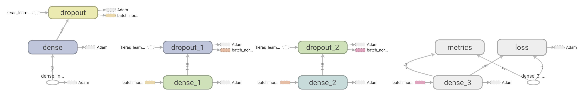

# Formula 1 Race Predictor

Formula 1 Race Predictor is a deep learning project that aims to predict the probabilities of a driver finishing a race in each grid position. Two neural networks are defined for the scope of this project:

1. Deep Neural Network (Multilayer Perceptron)
2. Recurrent Neural Network

The neural networks attempt to learn and predict outcomes using race data from the beginning of the Formula 1 world championships in 1950.

## Getting Started

The main package needed to run this project is either the GPU (recommended) or CPU version of [Tensorflow 2.0](https://www.tensorflow.org/beta). Use the package manager [pip](https://pip.pypa.io/en/stable/) to install either version:

```bash
pip install tensorflow-gpu==2.0.0-rc0    # GPU version

pip install tensorflow==2.0.0-rc0        # CPU version
```

For full GPU support, additional software requirements are needed. The full list of details and instructions are outlined [here](https://www.tensorflow.org/install/gpu).

## Data Acquisition & Cleanup

All necessary data was acquired from the official [Ergast Developer API](https://ergast.com/mrd/). The datasets are well organized with `results.csv` being the main file, binding via labels to the other specific datasets included. Upon being read, specific columns are selected from each dataset and labelled accordingly:

```
full_df = pd.read_csv(
        "../Datasets/Original/results.csv",
        header=None,
        usecols=[1,2,3,5,6,9,10,17],
        na_values='\\N',
        names=['race_id', 'driver_id', 'constructor_id', 'grid_position', 'final_position', 'race_points_scored', 'race_laps_completed', 'status_id'])

```

All datasets were joined excluding `lap_times.csv` and `pit_stops.csv` in order to make predictions using mostly pre-race data. Moreover, lap times and pit stops would cause the duplication/repetition of many rows of data, therefore, it was decided to do without these datasets.

Missing data points/features were filled with either the sum or weighted mean of various similar feature points throughout the entire set.

## Neural Network Architectures 
### Deep Neural Net (Multilayer Perceptron):

- Sequential Model
- Three Dense layers (128 neurons each; Rectified Linear activations)
- Dropout (Regularization) + Batch Normalization layers following each Dense layer (Prevents overfitting of data)
- One Dense output layer (# of neurons decided by user depending on how many positions wish to predict; Softmax activation for probability distribution)
- Data splits: Training - 70%, Validation - 15%, Testing - 15% (All shuffled)

### Recurrent Neural Net:

- Sequential Model
- Three Long Short Term Memory (LSTM) layers (128 neurons each; Tanh activation)
- Dropout (Regularization) + Batch Normalization layers following each LSTM layer (Prevents overfitting of data)
- One Dense + Dropout layer (64 neurons; Rectified Linear activation)
- One Dense output layer (# of neurons decided by user depending on how many positions wish to predict; Softmax activation for probability distribution)
- Data sorted with respect to year, round, and race position (Ascending order)
- Data Splits: Training - First 90%, Validation & Testing - Last 10%   


```
# Define a sequential neural net model
rnn_model = Sequential()

# First hidden layer passing inputs to
rnn_model.add(LSTM(128, input_shape=input_shape, return_sequences=True))
rnn_model.add(Dropout(0.2))                                             
rnn_model.add(BatchNormalization())                                     

# Second hidden layer
rnn_model.add(LSTM(128, return_sequences=True))
rnn_model.add(Dropout(0.2))
rnn_model.add(BatchNormalization())

# Third hidden layer
rnn_model.add(LSTM(128, return_sequences=True))
rnn_model.add(Dropout(0.2))
rnn_model.add(BatchNormalization())

# Fourth hidden layer
rnn_model.add(Dense(64, activation='relu'))                             
rnn_model.add(Dropout(0.2))

# Final output layer
rnn_model.add(Dense(num_classes, activation='softmax'))                 
```

## Results & Data Visualization
TensorBoard was used in order to visualize the accuracy and loss of training and validation data. Furthermore, model checkpoints were used in order to save the best models at each checkpoint (epoch) throughout training and validation. To launch the Tensorboard visualization tool, open a command prompt within the `Logs` directory and type:

```bash
tensorboard --logdir DNN/      # Use 'RNN' if want to visualize the Recurrent Neural Net metrics
```

The deep neural net model and metric tracking charts generated by Tensorboard are depicted below:

<p align="center">
  
</p>

<p align="center">
  
  
</p>

The red and blue lines depict the training and validation sets respectively. After 80 epochs of training/validation, predicting probability distributions for a grid ranging from positions 1 to 34 provided roughly for a 54% accuracy with around a 10% loss.

Results for the Recurrent Neural Net were deemed too insignificant due to the nature of the data being used for training. Although the data is linear in time, there are multiple data samples (drivers and constructors) per timestep, which ultimately is not suitable for an LSTM model. This network was mainly constructed for experimentation purposes and will perhaps be used in future time-series based deep learning gprojects!